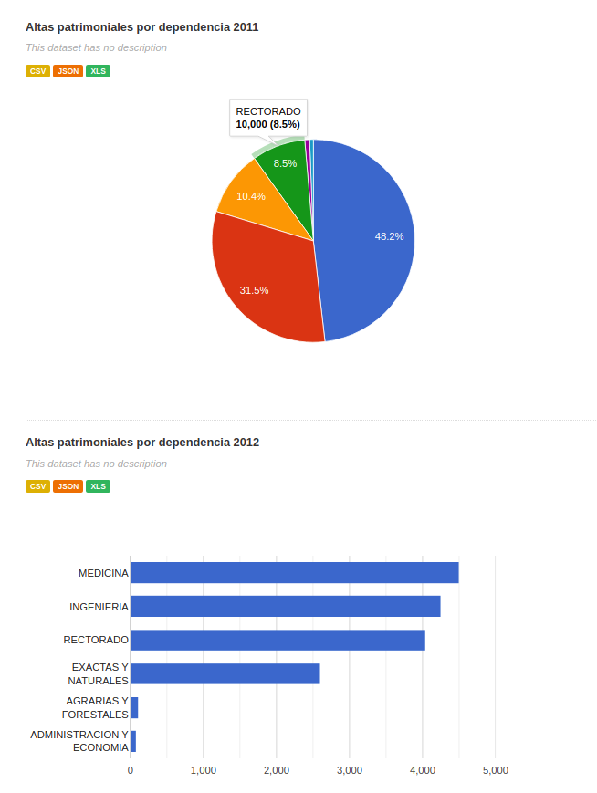
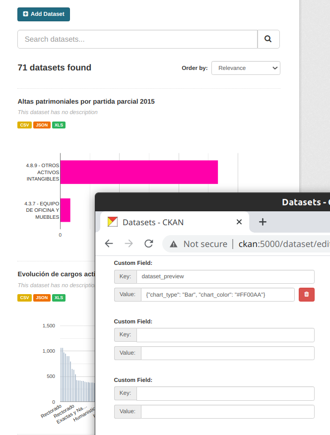

[](https://travis-ci.org/github/avdata99/ckanext-datasetpreview)
[](https://github.com/avdata99/ckanext-datasetpreview/releases)
[](https://github.com/avdata99/ckanext-datasetpreview/issues)
[](https://github.com/avdata99/ckanext-datasetpreview/pulls)
[](https://github.com/avdata99/ckanext-datasetpreview/blob/master/LICENSE)
[](https://pypi.org/project/ckanext-datasetpreview/)
[](https://github.com/avdata99/ckanext-datasetpreview/commits/master)

# CKAN dataset preview

Still in a develpment status

Adds automatically charts for all datasets in the dataset list.
Uses `messytables` to discover field types.

## How to set up?

### General extension config values

Available config options

```ini
# Define if the extension should draw chart for
# - 'ALL'    All datasets with a CSV resource
# - 'EXTRA' Just datasets with the 'dataset_preview' extra dictionary defined
# - 'NO'     No datasets with show any preview
ckanext.datasetpreview.draw = 'ALL'  # default draw all
ckanext.datasetpreview.chart_height = 300  # pixels

```
Each dataset could add and extra value with nthe key `dataset_preview`:

```js
extras["dataset_preview"] = {
    // field to use in the chart. Could be:
    // - A list of field names (valids in the CSV resource)
    // Default will be [0, 1] ( the first two columns in the CSV). You could use numbers instead of field names
    "fields": ["Field1", "Field2"],  
    "chart_type": "Bar", // Allows 'Pie', 'Bar', 'Column'
    // URL could be:
    // - A external url
    // - No use this value: will be "csv_resource" with pick the first CSV resource in the dataset
    // - Name of the resource in the datasets (must be a CSV one)
    "url": "csv_resource",
    "height": 450,  // pixels
    "chart_color": "#AA5521"
}
```
If you don't setup each dataset it will show the first CSV resource in the dataset (using the first two columns)




